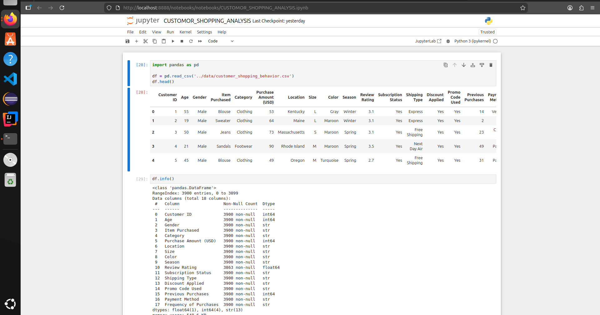
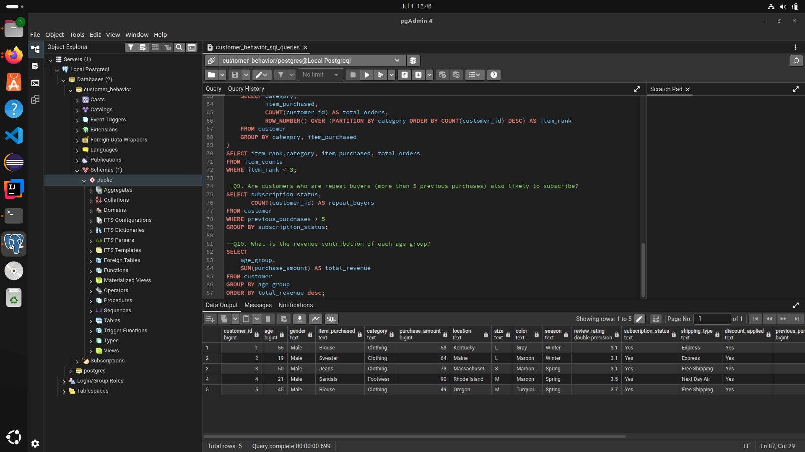
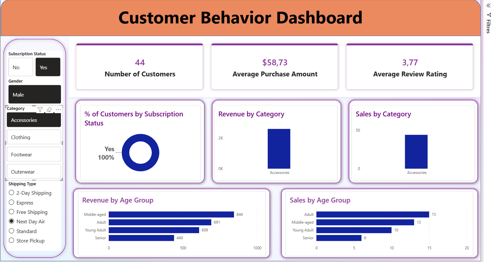

# Customer Behavior Data Analytics Project


> **End-to-end data analytics project** on a Retail Customer Shopping Behavior dataset — from raw data to interactive dashboard, following a real corporate workflow.

---

## 👩‍💻 Author

**Manal Moudoud**
- 💼 LinkedIn : [Manal Moudoud](https://www.linkedin.com/in/manal-moudoud-2ba42b13b/).

---

## 📌 Project Overview

This project simulates a complete, industry-standard data analytics workflow inside a retail business. The goal is to extract actionable business insights from customer shopping data using **Python**, **SQL**, and **Power BI**.

---

## 🛠️ Tools & Technologies

| Tool | Purpose |
|------|---------|
| 🐍 Python (pandas, numpy, matplotlib, seaborn) | Data cleaning & EDA |
| 🗄️ PostgreSQL 16 + pgAdmin 4 | Data storage & SQL analysis |
| 📊 Power BI Desktop | Interactive dashboard |
| 📓 Jupyter Notebook | Development environment |
| 🐧 Ubuntu 24 (Linux) | Working environment |
| 🐙 GitHub | Version control |

---

## 🎯 Business Problem Statement

A retail company wants to better understand its customers' shopping behavior in order to:

- 🔍 Identify the most valuable customer segments
- 💰 Understand which products and categories generate the most revenue
- 🎁 Analyze the impact of discounts and promotions on sales
- 🚚 Optimize shipping and subscription strategies

---

## 📁 Project Structure
customer-trends-analysis/
├── 📂 data/
│   └── customer_shopping_behavior.csv
├── 📂 notebooks/
│   └── Customer_Shopping_Behavior_Analysis.ipynb
├── 📂 sql/
│   └── customer_behavior_sql_queries.sql
├── 📂 powerbi/
│   └── customer_behavior_dashboard.pbix
└── 📄 README.md

---

## 🔄 Project Workflow
📥 Raw CSV Data
↓
🐍 Python — Data Cleaning & EDA
↓
🗄️ PostgreSQL — Data Storage & SQL Analysis
↓
📊 Power BI — Interactive Dashboard
↓
🐙 GitHub — Portfolio Publication

---

## 🐍 Step 1 : Data Cleaning & EDA (Python)



Key steps performed in Jupyter Notebook:

- ✅ Loaded raw CSV with `pandas`
- ✅ Standardized column names (lowercase + underscores)
- ✅ Handled missing values using **grouped median imputation** by category
- ✅ Created `age_group` column using `pd.qcut()` → Young Adult / Adult / Middle-aged / Senior
- ✅ Created `purchase_frequency_days` by mapping text frequencies to numeric days
- ✅ Dropped unnecessary columns
- ✅ Loaded cleaned DataFrame into PostgreSQL via **SQLAlchemy + psycopg2**

---

## 🗄️ Step 2 : SQL Business Analysis (PostgreSQL)



Business questions answered with SQL:

| # | Business Question | SQL Concepts |
|---|-------------------|-------------|
| 1 | Revenue by gender | `GROUP BY`, `SUM()` |
| 2 | Top 5 products by discount rate | `CASE WHEN`, `ROUND()` |
| 3 | Customer segmentation | `CTE`, `CASE WHEN` |
| 4 | Top 3 products per category | `CTE`, `ROW_NUMBER()`, `PARTITION BY` |

---

## 📊 Step 3 : Power BI Dashboard



Interactive dashboard featuring:

- 📌 **KPIs** : Number of Customers · Average Purchase Amount · Average Review Rating
- 🍩 **% of Customers by Subscription Status**
- 📊 **Revenue by Category**
- 📊 **Sales by Category**
- 📊 **Revenue by Age Group**
- 📊 **Sales by Age Group**
- 🔽 **Interactive filters** : Subscription Status · Gender · Category · Shipping Type

---

## 📈 Key Business Insights

- 🥇 **Middle-aged customers** generate the highest revenue among all age groups
- 🛍️ **Accessories** is the top revenue-generating category
- 💳 Customers with **subscriptions** show higher average purchase amounts
- 🚚 **Free Shipping** is the most preferred shipping method
- 👥 Most customers fall in the **Returning** segment (2–10 purchases)

---

## ⚙️ How to Run

```bash
# 1. Clone the repo
git clone https://github.com/manaess/customer-trends-analysis.git
cd customer-trends-analysis

# 2. Set up Python environment
python3 -m venv venv
source venv/bin/activate
pip install jupyter pandas numpy matplotlib seaborn sqlalchemy psycopg2-binary

# 3. Set up PostgreSQL
sudo -u postgres psql
CREATE DATABASE customer_behavior;
ALTER USER postgres PASSWORD 'your_password';
\q

# 4. Run the notebook
jupyter notebook notebooks/Customer_Shopping_Behavior_Analysis.ipynb
```

---
